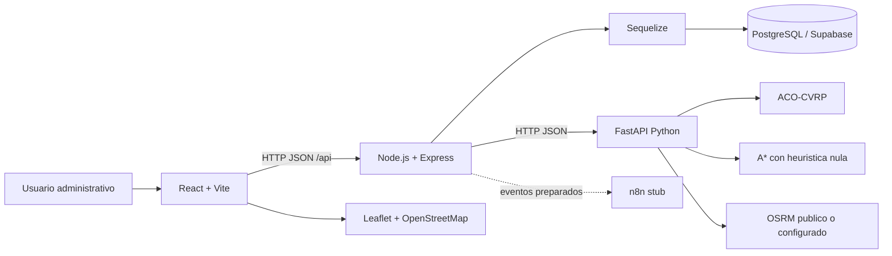
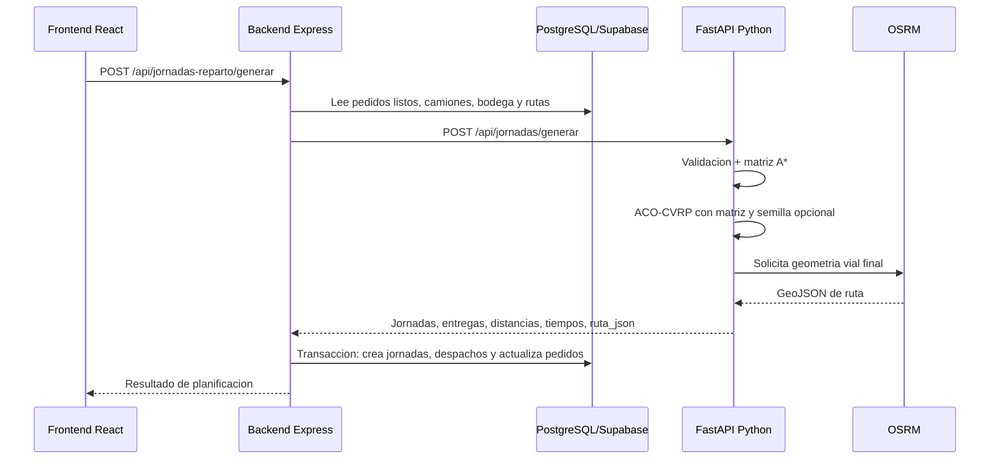

# 02 - Arquitectura general

## Vision general

TechSupply SCM - Modulo Outbound esta organizado como una aplicacion web con backend Node.js, base de datos PostgreSQL/Supabase, motor logistico Python y frontend React. El backend orquesta reglas de negocio, Python calcula rutas y jornadas, y el frontend presenta la operacion administrativa y geografica.



## Componentes y responsabilidades

| Componente | Responsabilidad |
| ---------- | --------------- |
| Backend Node.js | API REST, reglas de negocio, persistencia, transiciones de estado, integracion con Python y n8n |
| PostgreSQL/Supabase | Almacenamiento relacional, enums, restricciones, indices y JSONB |
| Python FastAPI | Construccion de grafo, calculo de ruta individual, generacion de jornadas y geometria |
| Frontend React | Interfaz administrativa, consumo de API, mapas, formularios, tablas y seguimiento |
| Leaflet/OpenStreetMap | Visualizacion geografica |
| OSRM | Calculo de geometria vial y distancia vial auxiliar |
| n8n | Integracion preparada para notificaciones/eventos; no activa aun |

## Backend

El backend usa:

- Node.js.
- Express.
- ES Modules.
- Sequelize.
- PostgreSQL.
- Migraciones Sequelize CLI.

Estructura principal:

```text
src/
├── config/
├── constants/
├── controllers/
├── middlewares/
├── models/
├── routes/
├── services/
└── utils/
```

El archivo `server.js` registra rutas bajo `/api`, configura CORS para el frontend local y autentica la conexion Sequelize.

## Base de datos

La base activa es PostgreSQL, conectada mediante `DATABASE_URL`. Las migraciones crean tablas, claves foraneas, indices, enums y checks. La columna `ruta_json` de jornadas y despachos fue migrada a JSONB.

## Python

El servicio Python usa FastAPI y expone:

- `POST /api/rutas/calcular`
- `POST /api/jornadas/generar`

Internamente construye un grafo bidireccional desde rutas activas, valida entradas con Pydantic, calcula una matriz de distancias entre bodega y destinos unicos, usa A* para poblar esa matriz y ACO-CVRP para asignar pedidos a camiones y ordenar destinos. OSRM se usa solo despues de elegir la solucion final para obtener geometria real; si falla, el sistema puede caer a lineas directas para visualizacion.

## Frontend

El frontend usa:

- React.
- Vite.
- React Router.
- Axios.
- Bootstrap y Bootstrap Icons.
- React Toastify.
- Leaflet y React Leaflet.

La estructura esta organizada por `app`, `shared` y `modules`. El layout principal incluye sidebar, topbar y rutas protegidas en cliente.

## Flujo de comunicacion



## Separacion de responsabilidades

- Frontend no calcula reglas logisticas; presenta datos y dispara acciones.
- Backend no implementa la metaheuristica; prepara datos, valida reglas y persiste resultados.
- Python no accede a la base de datos; recibe todo por JSON.
- n8n no debe bloquear la operacion principal cuando se active.
- La bodega central se identifica por `BODEGA_CENTRAL_ID = 1`.
