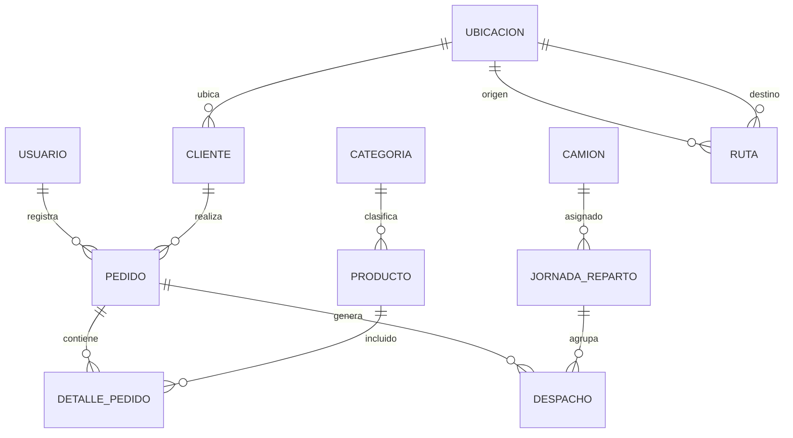

# 04 - Base de datos

## Tecnologia activa

La base de datos activa es PostgreSQL, normalmente mediante Supabase, conectada por `DATABASE_URL`. Sequelize opera como ORM y Sequelize CLI administra migraciones y seeders.

El proyecto tuvo referencias antiguas a MySQL durante etapas iniciales, pero no es la base activa del codigo actual.

## Migraciones

La migracion inicial crea el esquema principal con tablas, claves foraneas, enums, indices y restricciones. Una migracion posterior transforma `ruta_json` de `jornadas_reparto` y `despachos` a JSONB.

No se usa `sequelize.sync` en el arranque del servidor; `server.js` autentica la conexion con `sequelize.authenticate()`.

## Entidades principales

| Entidad | Tabla | Observaciones |
| ------- | ----- | ------------- |
| Usuario | `usuarios` | Correo unico, rol enum, estado booleano |
| Categoria | `categorias` | Nombre unico |
| Producto | `productos` | Categoria, precios, stock y checks |
| Ubicacion | `ubicaciones` | Coordenadas opcionales pero completas si existen |
| Ruta | `rutas` | Origen, destino, distancia, estado |
| Cliente | `clientes` | Identificacion y correo unicos, ubicacion obligatoria |
| Pedido | `pedidos` | Cliente, usuario, estado, total, fecha entrega |
| DetallePedido | `detalle_pedido` | Pedido-producto unico |
| Camion | `camiones` | Codigo y placa unicos, capacidad, estado |
| JornadaReparto | `jornadas_reparto` | Camion, estado, posicion, ruta JSONB |
| Despacho | `despachos` | Pedido, jornada, orden, ruta JSONB |

## Entidades inbound existentes

Existen tablas y modelos de compras e inventario:

- `proveedores`
- `ordenes_compra`
- `detalle_orden_compra`
- `ingresos_inventario`
- `detalle_ingreso`

Forman parte del esquema compartido, pero no son modulos expuestos por la API outbound actual.

## Relaciones principales



## Aliases Sequelize canonicos

Los aliases pertenecen al mapeo ORM y no cambian tablas, columnas ni claves foraneas. La matriz activa es:

| Asociacion | Alias |
| ---------- | ----- |
| `Categoria.hasMany(Producto)` | `productos` |
| `Producto.belongsTo(Categoria)` | `categoria` |
| `Ubicacion.hasMany(Cliente)` | `clientes` |
| `Cliente.belongsTo(Ubicacion)` | `ubicacion` |
| `Ubicacion.hasMany(Ruta)` por `origen_id` | `rutasOrigen` |
| `Ubicacion.hasMany(Ruta)` por `destino_id` | `rutasDestino` |
| `Ruta.belongsTo(Ubicacion)` por `origen_id` | `origen` |
| `Ruta.belongsTo(Ubicacion)` por `destino_id` | `destino` |
| `Cliente.hasMany(Pedido)` | `pedidos` |
| `Pedido.belongsTo(Cliente)` | `cliente` |
| `Usuario.hasMany(Pedido)` | `pedidos` |
| `Pedido.belongsTo(Usuario)` | `usuario` |
| `Pedido.hasMany(DetallePedido)` | `detalles` |
| `DetallePedido.belongsTo(Pedido)` | `pedido` |
| `Producto.hasMany(DetallePedido)` | `detallesPedido` |
| `DetallePedido.belongsTo(Producto)` | `producto` |
| `Pedido.hasMany(Despacho)` | `despachos` |
| `Despacho.belongsTo(Pedido)` | `pedido` |
| `Camion.hasMany(JornadaReparto)` | `jornadas` |
| `JornadaReparto.belongsTo(Camion)` | `camion` |
| `JornadaReparto.hasMany(Despacho)` | `despachos` |
| `Despacho.belongsTo(JornadaReparto)` | `jornada` |
| `Proveedor.hasMany(OrdenCompra)` | `ordenesCompra` |
| `OrdenCompra.belongsTo(Proveedor)` | `proveedor` |
| `Usuario.hasMany(OrdenCompra)` | `ordenesCompra` |
| `OrdenCompra.belongsTo(Usuario)` | `usuario` |
| `OrdenCompra.hasMany(DetalleOrdenCompra)` | `detalles` |
| `DetalleOrdenCompra.belongsTo(OrdenCompra)` | `ordenCompra` |
| `Producto.hasMany(DetalleOrdenCompra)` | `detallesOrdenCompra` |
| `DetalleOrdenCompra.belongsTo(Producto)` | `producto` |
| `OrdenCompra.hasMany(IngresoInventario)` | `ingresosInventario` |
| `IngresoInventario.belongsTo(OrdenCompra)` | `ordenCompra` |
| `Usuario.hasMany(IngresoInventario)` | `ingresosInventario` |
| `IngresoInventario.belongsTo(Usuario)` | `usuario` |
| `IngresoInventario.hasMany(DetalleIngreso)` | `detalles` |
| `DetalleIngreso.belongsTo(IngresoInventario)` | `ingresoInventario` |
| `Producto.hasMany(DetalleIngreso)` | `detallesIngreso` |
| `DetalleIngreso.belongsTo(Producto)` | `producto` |

## Tipos importantes

- Coordenadas: `DECIMAL(10,8)` para latitud y `DECIMAL(11,8)` para longitud.
- Distancias: `DECIMAL(10,2)`.
- Tiempos: enteros en minutos.
- Fechas: `DATE` o `DATEONLY` segun el uso.
- `ruta_json`: JSONB en jornadas y despachos.

## JSONB

`JornadaReparto.ruta_json` almacena la ruta general:

```json
{
  "bodega": {
    "id": 1,
    "nombre": "Bodega Central",
    "latitud": -1.05458,
    "longitud": -80.45445
  },
  "puntos": [
    {
      "orden": 1,
      "pedido_id": 10,
      "cliente_id": 3,
      "cliente": "Cliente",
      "destino_id": 2,
      "ubicacion": "Destino",
      "latitud": -0.78601,
      "longitud": -80.23473,
      "estado": "PENDIENTE"
    }
  ],
  "geometria": [[-1.05458, -80.45445], [-0.78601, -80.23473]],
  "tramos": [
    {
      "orden": 1,
      "tipo": "ENTREGA",
      "desde": { "id": 1, "nombre": "Bodega Central" },
      "hasta": { "id": 2, "nombre": "Destino" },
      "desde_indice": 0,
      "hasta_indice": 1
    }
  ]
}
```

`Despacho.ruta_json` almacena la ruta parcial hacia el punto de entrega:

```json
{
  "desde": {
    "id": 1,
    "nombre": "Bodega Central",
    "latitud": -1.05458,
    "longitud": -80.45445
  },
  "hasta": {
    "id": 2,
    "nombre": "Destino",
    "latitud": -0.78601,
    "longitud": -80.23473
  },
  "ruta_nodos": [1, 2],
  "geometria": [[-1.05458, -80.45445], [-0.78601, -80.23473]]
}
```

## Indices y restricciones relevantes

- `detalle_pedido`: indice unico por `pedido_id` y `producto_id`.
- `rutas`: indice unico por `origen_id` y `destino_id`.
- `pedidos`: indices por `estado`, `fecha_entrega` y `cliente_id`.
- `jornadas_reparto`: indices por `camion_id`, `estado` y `fecha`.
- `despachos`: indice por `jornada_reparto_id` y `orden_entrega`.
- Checks para capacidad positiva, distancias positivas/no negativas, stock no negativo, precios coherentes y coordenadas validas.

## Dependencia de la bodega central

El backend usa `BODEGA_CENTRAL_ID = 1`. La base debe contener una ubicacion con ese ID y coordenadas completas. Si cambia el seed o se reconstruye la base, esta dependencia debe verificarse.

## Riesgos actuales

- No existe restriccion unica para impedir por base de datos dos jornadas activas del mismo camion.
- No existe restriccion parcial para impedir multiples despachos activos por pedido.
- Algunas reglas de consistencia viven solo en servicios.
- El `ruta_json` puede desactualizarse si se modifican ubicaciones despues de generar jornadas.
