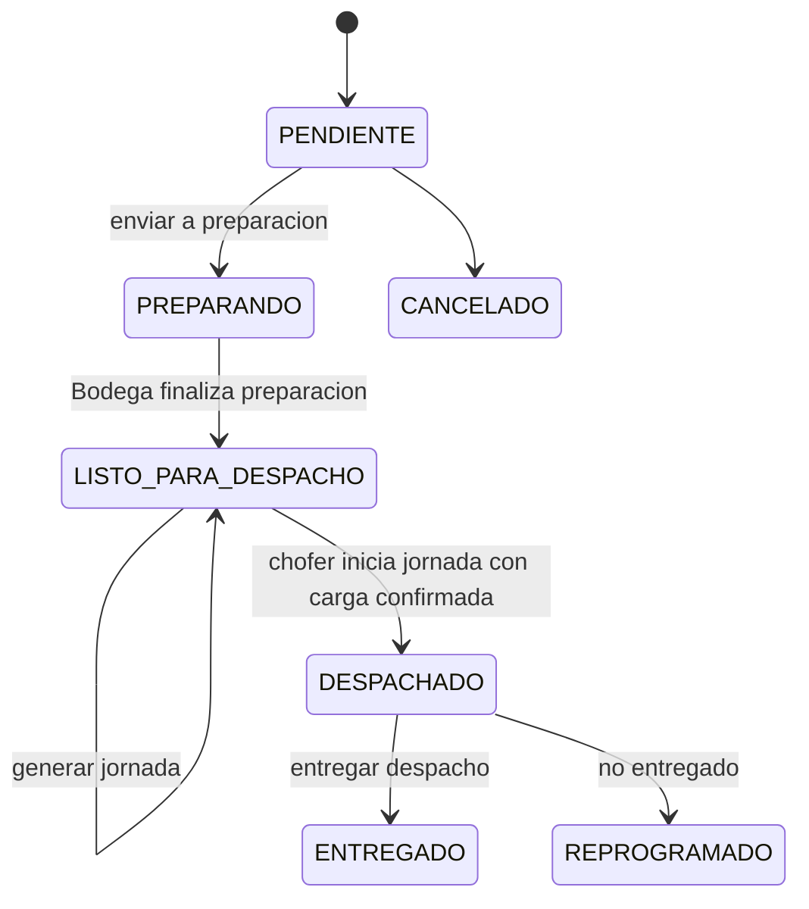
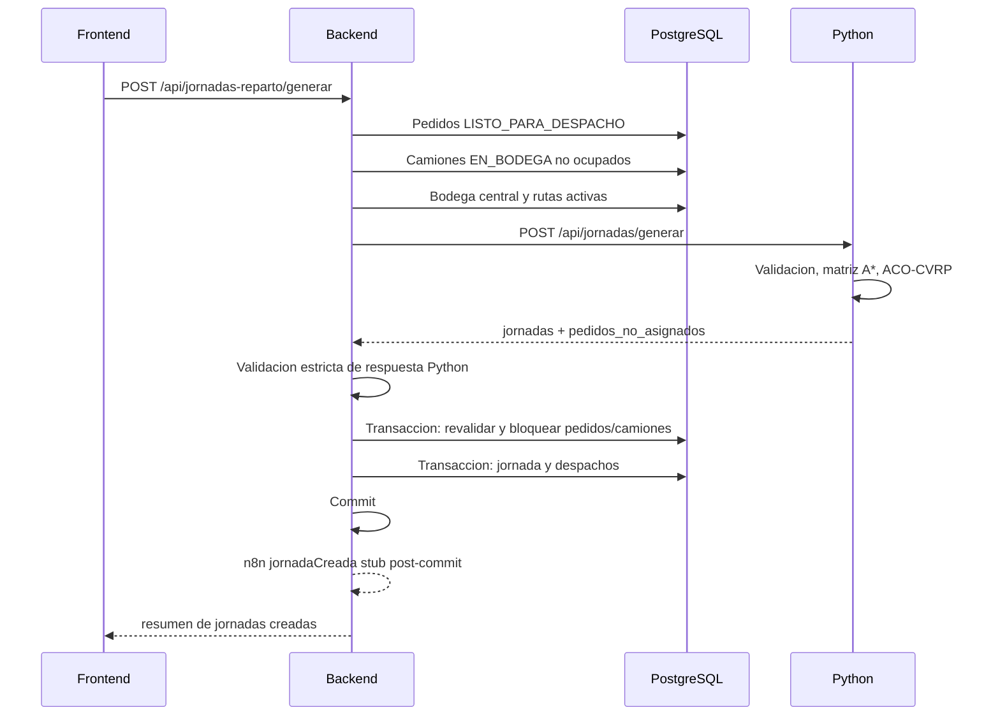
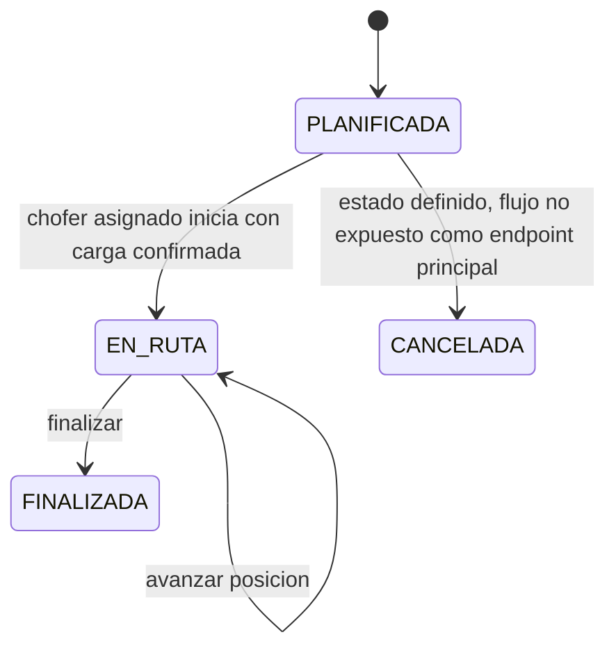

# 07 - Flujos, contratos e integraciones

## Flujo completo de pedido a jornada



## Generacion de jornada



La llamada a Python ocurre antes de abrir la transaccion. Despues de recibir el plan, el backend vuelve a consultar y bloquear los pedidos propuestos, los camiones propuestos, los despachos activos y las jornadas activas. Si alguno cambio entre la planificacion y la persistencia, no se guarda ningun dato parcial. La planificacion no marca pedidos como `DESPACHADO`.

## Preparacion y carga

Bodega prepara cantidades por detalle con `PATCH /api/bodega/detalles/:id/preparacion` y finaliza pedidos completos con `PATCH /api/bodega/pedidos/:id/finalizar-preparacion`.

La carga se gestiona con `PATCH /api/bodega/despachos/:id/carga` y se confirma por jornada con `PATCH /api/bodega/jornadas/:id/confirmar-carga`. Una jornada `PLANIFICADA` no puede iniciar si no tiene todos los despachos cargados y `carga_confirmada_en`.

## Inicio, avance y finalizacion



## Entrega y no entrega

Para entregar o marcar no entregado, el despacho debe:

- Estar `EN_TRANSITO`.
- Pertenecer a una jornada `EN_RUTA`.
- Tener `orden_entrega` igual a `posicion_actual_orden`.
- Ser operado por el chofer asignado a la jornada o por `ADMIN`.

Entrega:

- Despacho pasa a `ENTREGADO`.
- Pedido pasa a `ENTREGADO`.
- La jornada avanza al siguiente punto cuando el punto actual queda cerrado y existe un orden pendiente posterior.

No entrega:

- Despacho pasa a `NO_ENTREGADO`.
- Pedido pasa a `REPROGRAMADO`.
- La jornada aplica el mismo avance de posicion cuando corresponde.

Estas operaciones se ejecutan dentro de una misma transaccion. Si falla la actualizacion de pedido o jornada, el despacho conserva su estado anterior.

## Retorno a bodega

La ruta general de una jornada incluye el tramo de retorno a bodega. La finalizacion de jornada representa que el camion completo la ruta y vuelve a quedar `EN_BODEGA`.

## Contrato Frontend-Backend

Las respuestas del backend usan:

```json
{
  "success": true,
  "message": "Operacion realizada correctamente",
  "data": {}
}
```

El frontend normalmente lee `response.data.data`.

Las relaciones incluidas por Sequelize forman parte del contrato JSON con aliases camelCase explicitos. Ejemplos de lectura vigentes:

| Antes implicito por Sequelize | Contrato actual |
| ----------------------------- | --------------- |
| `Pedido.Cliente` | `pedido.cliente` |
| `Pedido.Usuario` | `pedido.usuario` |
| `Pedido.DetallePedidos` | `pedido.detalles` |
| `DetallePedido.Producto` | `detalle.producto` |
| `Cliente.Ubicacion` | `cliente.ubicacion` |
| `Producto.Categoria` | `producto.categoria` |
| `Despacho.Pedido` | `despacho.pedido` |
| `Despacho.JornadaReparto` | `despacho.jornada` |
| `JornadaReparto.Camion` | `jornada.camion` |
| `JornadaReparto.Despachos` | `jornada.despachos` |

Los cambios de alias no modifican endpoints, estados, reglas de transicion, payloads Node-Python, `ruta_json` ni integraciones n8n.

Endpoints usados por frontend:

| Modulo | Endpoint |
| ------ | -------- |
| Auth | `POST /auth/login`, `GET /auth/me` |
| Dashboard | `GET /pedidos`, `/clientes`, `/ubicaciones`, `/rutas`, `/despachos`, `/jornadas-reparto`, `/camiones`, `/productos` |
| Clientes | CRUD `/clientes`, consulta `/ubicaciones` |
| Ubicaciones | CRUD `/ubicaciones` |
| Pedidos | CRUD `/pedidos`, patches de estado, CRUD `/detalles-pedido` |
| Rutas | CRUD `/rutas`, consulta `/camiones`, `/jornadas-reparto/mapa-general` |
| Logistica | `/despachos/pedidos-disponibles`, `/jornadas-reparto/*`, `/despachos/:id/entregar`, `/despachos/:id/no-entregado` |
| Despachos | `GET /despachos`, `GET /despachos/:id` |
| Bodega | `/bodega/pedidos`, `/bodega/jornadas`, `/bodega/despachos/:id/carga` |
| Choferes | `/choferes`, `/choferes/disponibles`, `/jornadas-reparto/mis-jornadas` |

## Contrato Node-Python: ruta individual

Node envia a Python:

```json
{
  "origenId": 1,
  "destinoId": 2,
  "rutas": [
    {
      "origen": 1,
      "destino": 2,
      "distancia": 10
    }
  ]
}
```

Python responde:

```json
{
  "ruta": [1, 2],
  "distancia_total": 10,
  "tiempo_estimado": 15
}
```

Python puede responder errores controlados:

```json
{
  "error": {
    "code": "INVALID_DISTANCE",
    "message": "La distancia debe ser finita y mayor que cero",
    "details": {}
  }
}
```

Node normaliza errores 4xx, 5xx, timeout, conexion fallida y respuesta invalida manteniendo la estructura HTTP externa del backend.

Desde Node, los fallos de Python se representan como `ExternalServiceError`. El mensaje publico conserva el contexto anterior, pero el middleware central evita exponer detalles internos inesperados cuando el error no es operacional.

## Contrato Node-Python: jornadas

Node envia:

```json
{
  "bodega": {
    "id": 1,
    "nombre": "Bodega Central",
    "latitud": -1.05458,
    "longitud": -80.45445
  },
  "camiones": [
    {
      "id": 1,
      "codigo": "CAM-001",
      "placa": "ABC-123",
      "capacidad": 4
    }
  ],
  "pedidos": [
    {
      "pedido_id": 10,
      "cliente_id": 3,
      "cliente": "Cliente",
      "destino_id": 2,
      "ubicacion": "Destino",
      "latitud": -0.78601,
      "longitud": -80.23473,
      "fecha_entrega": "2026-07-23"
    }
  ],
  "grafo": [
    {
      "origen": 1,
      "destino": 2,
      "distancia": 10
    }
  ],
  "velocidad_kmh": 40,
  "semilla": 42,
  "benchmark": false,
  "aco": {
    "num_hormigas": 12,
    "iteraciones": 30,
    "iteraciones_sin_mejora": 12,
    "semilla": 42
  }
}
```

Python responde:

```json
{
  "jornadas": [
    {
      "camion_id": 1,
      "capacidad_camion": 4,
      "capacidad_utilizada": 1,
      "ruta_general": {
        "bodega": {},
        "puntos": [],
        "geometria": [],
        "tramos": []
      },
      "distancia_total_km": 20,
      "tiempo_estimado_min": 30,
      "entregas": [
        {
          "pedido_id": 10,
          "orden_entrega": 1,
          "ruta_parcial": {
            "desde": {},
            "hasta": {},
            "ruta_nodos": [1, 2],
            "geometria": []
          },
          "distancia_acumulada_km": 10,
          "tiempo_acumulado_min": 15,
          "fecha_estimada_entrega": "2026-07-23T10:15:00"
        }
      ]
    }
  ],
  "pedidos_no_asignados": [],
  "pedidos_no_asignados_detalle": []
}
```

Node valida antes de persistir:

- Camiones conocidos y no duplicados.
- Pedidos conocidos, no duplicados y clasificados exactamente una vez.
- Pedidos no asignados sin cruce con entregas.
- Capacidad por camion.
- Distancias y tiempos finitos.
- Geometria en pares `[latitud, longitud]`.
- Retorno a bodega mediante tramo `RETORNO_BODEGA`.

Si la validacion falla, no se abre la transaccion de persistencia.

## Estructura real de `ruta_json`

La jornada guarda `ruta_general`. El despacho guarda `ruta_parcial`. Ambas columnas son JSONB en PostgreSQL.

La geometria se expresa como arreglos `[latitud, longitud]`, formato usado por Leaflet.

## Eventos n8n preparados

Funciones existentes:

- `despachoCreado`
- `despachoIniciado`
- `despachoEntregado`
- `despachoCancelado`
- `jornadaCreada`
- `jornadaIniciada`
- `despachoNoEntregado`
- `jornadaFinalizada`

Estado real: stub con `console.log`. No hay URLs de webhook, reintentos, timeout propio, cola, idempotencia ni trazabilidad persistida.

`jornadaCreada` se emite despues del commit con la instancia real de la jornada creada y los despachos creados en la transaccion. El resumen devuelto al frontend se mantiene sin cambios.

`despachoEntregado` y `despachoNoEntregado` tambien se ejecutan despues del commit en el servicio de despachos asociado a jornadas. Un fallo del stub n8n no revierte la entrega ni la no entrega confirmada.

## Integracion OSRM

OSRM se usa en dos lugares:

- Python: geometria de jornadas.
- Frontend de rutas: calculo vial auxiliar al crear rutas.

Python usa OSRM solo despues de seleccionar la solucion final y aplica cache por tramo dentro de la solicitud. OSRM no se ejecuta dentro de ACO. El frontend conserva su uso para catalogo/previsualizacion de rutas; no fue refactorizado en esta fase.
